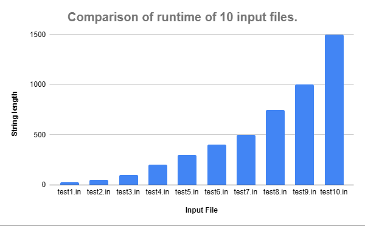

# Programming Assignment 3: Highest Value Longest Common Sequence

**Student Name:** Semyon Baykov

**UFID:** 65667853

## Instructions to Run
To run the code, you must have python installed and use the following command:
```bash
python src/main.py <input_file>
```
Examples:
```bash
python src/main.py data/example.in
```
```bash
python src/main.py data/example.in > data/example.out
```


## Question 1: Empirical Comparison

| Input File | Length  | Runtime (s) |
|---|---|---|
| `test1.in` | 25 | 0.039544 |
| `test2.in` | 50 | 0.031572 |
| `test3.in` | 100 | 0.034366 |
| `test4.in` | 200 | 0.044902 |
| `test5.in` | 300 | 0.056536 |
| `test6.in` | 400 | 0.082778 |
| `test7.in` | 500 | 0.121796 |
| `test8.in` | 750 | 0.174191 |
| `test9.in` | 1000 | 0.314375 |
| `test10.in` | 1500 | 0.765482 |



## Question 2: Recurrence Equation

**Recurrence:**

Let OPT(i, j) be the maximum value of a common subsequence of strings A[1...i] and B[1...j]. Let v(c) be the value assigned to character c.

OPT(i, j) = Cases 1-3:
1) if i=0 or j=0 -> 0
2) if A[i]=B[j] -> OPT(i-1, j-1) + v(A[i])
3) if A[i] != B[j] -> max(OPT(i-1, j), OPT(i, j-1))

**Base cases:**

- H(0, j) = 0 for all values of j between 0 and m.
- H(i, 0) = 0 for all values of i between 0 and n.

**Explanation:**
- If either string is empty, only the empty string is possible, so the value is 0.
- When A[i] = B[j], including this matching character at the end of an optimal HVLCS of A[1...i-1] and B[1...j-1] will maximize the total value. Since all character values are non-negative, including a match never decreases the total value.
- When A[i] != B[j], the last character of the optimal HVLCS cannot be both A[i] and B[j]. Therefore, it must be an optimal common subsequence of either A[1...i-1] and B[1...j] or A[1...i] and B[1...j-1]. We take the maximum value of these two possibilities.

## Question 3: Big-Oh

**Pseudocode:**
```python
Algorithm: ComputeHVLCSValue(A, B, weights)
  Initialize n to length(A) and m to length(B)
  Create a 2D array DP of size (n+1) by (m+1)
  Initialize DP[i][0] = 0 for all i from 0 to n
  Initialize DP[0][j] = 0 for all j from 0 to m

  for i from 1 to n:
    for j from 1 to m:
      if A[i-1] == B[j-1]: 
        Set DP[i][j] to DP[i-1][j-1] + weights[A[i-1]]
      else:
        Set DP[i][j] to max(DP[i-1][j], DP[i][j-1])
  
  return DP at n,m
```

**Runtime Analysis:**

Time: The algorithm uses nested loops to iterate through every cell in a table of size n by m (where n is len(A) and m is len(B)), and each cell takes O(1) time to compute. Therefore, the total time complexity is O(nm).

Space: The algorithm has to store the results inside the dp array, which means the space complexity is also O(nm).
